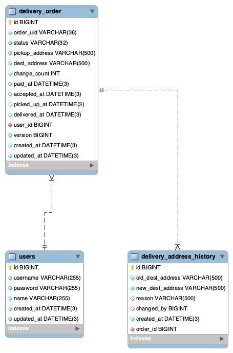

# delivery-service

Spring Boot 기반의 간단한 **배달 서비스 백엔드 API** 입니다.  
회원가입, 로그인(JWT), 배달 조회, 배달 목적지 변경 기능을 중심으로 작성되었습니다.

---

## 프로젝트 구조

### 기술 스택

- **Java**: 17
- **Spring Boot**: 3.5.5
- **Spring Data JPA**
- **Spring Security**
- **Spring Validation**
- **H2 Database** (개발/테스트 환경)
- **JWT (jjwt 0.12.5)**
- **Swagger / OpenAPI (springdoc-openapi)**
- **Gradle**
- **Lombok**
- **JUnit 5**

### 주요 기능

- 회원가입/로그인
    - JWT 발급 및 인증
- 배달 조회
    - 기간 필수 (최대 3일)
    - 페이징
- 배달 주소지 변경
    - 변경 가능 상태에서만 허용 (픽업 이전 까지)
    - `Optimistic Lock` 적용 (@Version)
    - 변경 횟수 관리
    - 변경 이력 기록 (history table)
    - 변경하려는 주소가 이전 주소와 같은 경우 업데이트 하지 않음
- 기타
    - 초기 데이터 제공 (data.sql)

### DB 구조



- `users` (회원 정보) 
  - 회원(사용자)의 로그인/식별 정보를 저장하는 기본 테이블
- `delivery_order` (배달 주문 정보)
  - 사용자가 생성한 배달 주문의 상태와 주요 정보를 저장
- `delivery_address_history` (배달 주소 변경 이력)
  - 주문에 대해 배달 주소지가 변경될 때마다 히스토리를 저장

---

## 인증

### Header

|  Header name  | Description                     | 입력 유형 |
|:-------------:|---------------------------------|:-----:|
| Authorization | Bearer 토큰 (회원가입, 로그인 그외 요청은 필수) |  선택   |

## 상태 코드

### 상태코드 형식

```text
API 요청시 응답은 HTTP 상태코드(3자리)와 서비스 상태코드(5자리)로 구성된다.
```

### 성공 상태코드

| HTTP 상태코드 |   상태코드   | 설명            |
|:---------:|:--------:|:--------------|
|   `200`   | 20000000 | 요청 성공         |
|   `201`   | 20100000 | 생성 성공         |
|   `204`   | 20400000 | 요청 성공(컨텐츠 없음) |

### 에러 상태코드

| HTTP 상태코드 |     상태코드 | 설명                   |
|:---------:|---------:|----------------------|
|   `400`   | 40000000 | 잘못된 요청               |
|   `401`   | 40100000 | 인증되지 않은 요청           |
|   `401`   | 40100001 | 토큰이 만료되었습니다.         |
|   `401`   | 40100002 | 유효하지 않은 토큰입니다.       |
|   `401`   | 40101000 | 아이디 또는 비밀번호가 일치하지 않음 |
|   `403`   | 40300000 | 접근 권한 없음             |
|   `404`   | 40400000 | 리소스를 찾을 수 없음         |
|   `405`   | 40500000 | 지원하지 않는 메서드          |
|   `406`   | 40600000 | 허용되지 않는 응답 형식        |
|   `409`   | 40900000 | 리소스 충돌               |
|   `415`   | 41500000 | 지원하지 않는 미디어 포맷       |
|   `500`   | 50000000 | 서버 내부 오류             |
|   `502`   | 50000000 | 외부 서버에서 잘못된 응답 수신    |
|   `503`   | 50300000 | 서비스를 일시적으로 사용할 수 없음  |


---

## 요구사항

1. **회원 가입 API**
    - [x] ID, 비밀번호, 사용자 이름 입력
    - [x] 비밀번호 정책: 대문자/소문자/숫자/특수문자 중 3종류 이상, 최소 12자

2. **로그인 API**
    - [x] ID/비밀번호 검증
    - [x] JWT AccessToken 발급

3. **배달 조회 API**
    - [x] 기간 필수 입력 (최대 3일)
    - [x] 조건(상태 등) 추가 가능
    - [x] 해당 기간 내 사용자가 주문한 배달 리스트 반환

4. **배달 주문 수정 API (도착지 변경)**
    - [x] 도착지 주소 변경
    - [x] 변경 가능 상태에서만 허용

---

## 실행 방법

```bash
# 빌드 & 실행
./gradlew clean bootRun
```

### H2 인메모리 DB 사용 (개발 환경)

- H2 데이터베이스 콘솔을 통해 로컬 데이터베이스를 확인할 수 있습니다.
- http://localhost:8080/h2-console

### 연동 규격서 (API Document)

- http://localhost:8080/swagger-ui/index.html

---

## ⚠️ 미구현 및 보완 예정

- 테스트 케이스 보강
- 도착지 변경 횟수 제한
- Refresh Token 도입
- Redis 도입하여 RefreshToken 저장
- 로그인 실패 횟수 제한
- H2 인메모리 DB에서 MySQL DB 로 변경
- 요청 응답 로깅
- 배달 주소 변경 히스토리 테이블 파티셔닝 관리
- 사용자 주문 생성/조회/삭제 기능 추가
- 라이더(배달기사) 배정 기능 추가